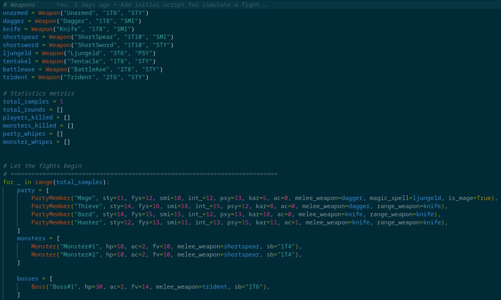

# Dragonbane fight simulator

Small simple simulator to check if your party have a chance or not vs monsters

## Tested with
Works on linux with python3

## Installation
* Make sure you have Python3 installed
* Clone the repository to your computer
`git clone https://github.com/mattiasr/dragonbane_fight_simulator.git`

## Running the simulation
1. Make sure you have weapons, players and monsters added to `simulate.py`

2. Set the number of times you like to run the simulation by edit `total_samples`
3. Run the simulation by executing `python3 simulate.py` or `./simulate.py`

## Example of 1k fights with the same party members and monsters showing last fight as a log  
```
Round 1: Initiative ['💙 Thieve', '💙 Bard', ['💚 Boss#1'], '💙 Mage', '💙 Hunter', ['💚 Monster#1', '💚 Monster#2']]
	🛈	Thieve rolls FV: 14 against FV: 14 ([14])
	⚔	Thieve attacks Boss#1 with Dagger (1T8 + 1T6) hits for 5-2 damage ([2, 3])
	💚	Boss#1: 27/30
	🛈	Bard rolls FV: 6 against FV: 12 ([6])
	⚔	Bard attacks Boss#1 with Knife (1T8 + 1T4) hits for 8-2 damage ([6, 2])
	💚	Boss#1: 21/30
	🛈	Boss#1 rolls FV: 9 against FV: 14 ([9])
	⚔	Boss#1 attacks Bard with Trident (2T6 + 0) hits for 6-0 damage ([3, 3])
	💙	Bard: 9/15
	🛈	Mage rolls FV: 4 against FV: 12 ([4])
	✨	Mage attacks Monster#2 with Ljungeld (3T6) hits for 17-2 damage ([6, 6, 5])
	💚	Monster#2: -5/10
	💀	Monster#2 is dead
	🛈	Hunter rolls FV: 9 against FV: 10 ([9])
	⚔	Hunter attacks Boss#1 with Knife (1T8 + 0) hits for 3-2 damage ([3])
	💚	Boss#1: 20/30
	❌	Monster#1 rolls FV: 15 against FV: 10 ([15])
	⚔	Monster#1 attacks Bard with ShortSpear (1T10 + 1T4) misses...
	👀	Monster#2 looks at Mage, i will deal with you later...
	❌	Monster#2 rolls FV: 19 against FV: 10 ([19])
	⚔	Monster#2 attacks Mage with ShortSpear (1T10 + 1T4) misses...
Round 2: Initiative ['💙 Mage', ['💚 Boss#1'], '💙 Hunter', ['💚 Monster#1', '💀 Monster#2'], '💙 Thieve', '💙 Bard']
	❌	Mage rolls FV: 16 against FV: 12 ([16])
	✨	Mage attacks Boss#1 with Ljungeld (3T6) misses...
	🛈	Boss#1 rolls FV: 13 against FV: 14 ([13])
	⚔	Boss#1 attacks Bard with Trident (2T6 + 0) hits for 7-0 damage ([5, 2])
	💙	Bard: 2/15
	🛈	Hunter rolls FV: 2 against FV: 10 ([2])
	⚔	Hunter attacks Boss#1 with Knife (1T8 + 0) hits for 8-2 damage ([8])
	💚	Boss#1: 14/30
	🛈	Monster#1 rolls FV: 7 against FV: 10 ([7])
	⚔	Monster#1 attacks Bard with ShortSpear (1T10 + 1T4) hits for 9-0 damage ([8, 1])
	💙	Bard: -7/15
	☠	Bard is down
	❌	Monster#2 rolls FV: 14 against FV: 10 ([14])
	⚔	Monster#2 attacks Mage with ShortSpear (1T10 + 1T4) misses...
	💥	Thieve rolls FV: 1 against FV: 14 ([1])
	⚔	Thieve attacks Boss#1 with Dagger (1T8 + 1T6) hits for 14-2 damage ([4, 5, 5])
	💚	Boss#1: 2/30
	🎲💚	Bard manage to survive perma death this time 1/3 ([13])
Round 3: Initiative ['☠ Bard', '💙 Hunter', ['💚 Monster#1', '💀 Monster#2'], '💙 Mage', ['💚 Boss#1'], '💙 Thieve']
	🎲💚	Bard manage to survive perma death this time 2/3 ([8])
	🛈	Hunter rolls FV: 10 against FV: 10 ([10])
	⚔	Hunter attacks Boss#1 with Knife (1T8 + 0) hits for 7-2 damage ([7])
	💚	Boss#1: -3/30
	💀	Boss#1 is dead
	👀	Monster#1 looks at Mage, i will deal with you later...
	🛈	Monster#1 rolls FV: 6 against FV: 10 ([6])
	⚔	Monster#1 attacks Hunter with ShortSpear (1T10 + 1T4) hits for 3-1 damage ([2, 1])
	💙	Hunter: 11/13
	❌	Monster#2 rolls FV: 20 against FV: 10 ([20])
	⚔	Monster#2 attacks Mage with ShortSpear (1T10 + 1T4) misses...
	🌿	Mage runs and heal Bard for 7 HP ([1, 6])
	💙	Bard: 7/15
	🛈	Boss#1 rolls FV: 3 against FV: 14 ([3])
	⚔	Boss#1 attacks Bard with Trident (2T6 + 0) hits for 4-0 damage ([1, 3])
	💙	Bard: 3/15
	🛈	Thieve rolls FV: 12 against FV: 14 ([12])
	⚔	Thieve attacks Monster#1 with Dagger (1T8 + 1T6) hits for 6-2 damage ([1, 5])
	💚	Monster#1: 6/10
Round 4: Initiative ['💙 Bard', '💙 Hunter', ['💚 Monster#1', '💀 Monster#2'], ['💀 Boss#1'], '💙 Mage', '💙 Thieve']
	❌	Bard rolls FV: 17 against FV: 12 ([17])
	⚔	Bard attacks Monster#1 with Knife (1T8 + 1T4) misses...
	❌	Hunter rolls FV: 20 against FV: 10 ([20])
	⚔	Hunter attacks Monster#1 with Knife (1T8 + 0) misses...
	🛈	Monster#1 rolls FV: 10 against FV: 10 ([10])
	⚔	Monster#1 attacks Hunter with ShortSpear (1T10 + 1T4) hits for 10-1 damage ([8, 2])
	💙	Hunter: 2/13
	❌	Monster#2 rolls FV: 16 against FV: 10 ([16])
	⚔	Monster#2 attacks Mage with ShortSpear (1T10 + 1T4) misses...
	💥	Boss#1 rolls FV: 1 against FV: 14 ([1])
	⚔	Boss#1 attacks Bard with Trident (2T6 + 0) hits for 12-0 damage ([1, 5, 6])
	💙	Bard: -9/15
	☠	Bard is down
	❌	Mage rolls FV: 13 against FV: 12 ([13])
	✨	Mage attacks Monster#1 with Ljungeld (3T6) misses...
	🛈	Thieve rolls FV: 7 against FV: 14 ([7])
	⚔	Thieve attacks Monster#1 with Dagger (1T8 + 1T6) hits for 7-2 damage ([2, 5])
	💚	Monster#1: 1/10
Round 5: Initiative ['☠ Bard', '💙 Thieve', ['💀 Boss#1'], '💙 Hunter', ['💚 Monster#1', '💀 Monster#2'], '💙 Mage']
	🎲💚	Bard manage to survive perma death this time 1/3 ([12])
	❌	Thieve rolls FV: 19 against FV: 14 ([19])
	⚔	Thieve attacks Monster#1 with Dagger (1T8 + 1T6) misses...
	🛈	Boss#1 rolls FV: 7 against FV: 14 ([7])
	⚔	Boss#1 attacks Hunter with Trident (2T6 + 0) hits for 5-1 damage ([4, 1])
	💙	Hunter: -2/13
	☠	Hunter is down
	🎲💚	Hunter manage to survive perma death this time 1/3 ([7])
	👀	Monster#1 looks at Mage, i will deal with you later...
	❌	Monster#1 rolls FV: 14 against FV: 10 ([14])
	⚔	Monster#1 attacks Thieve with ShortSpear (1T10 + 1T4) misses...
	🛈	Monster#2 rolls FV: 4 against FV: 10 ([4])
	⚔	Monster#2 attacks Mage with ShortSpear (1T10 + 1T4) hits for 5-0 damage ([3, 2])
	💙	Mage: 7/12
	🌿	Mage runs and heal Bard for 4 HP ([3, 1])
	💙	Bard: 4/15
Round 6: Initiative ['💙 Thieve', ['💚 Monster#1', '💀 Monster#2'], ['💀 Boss#1'], '☠ Hunter', '💙 Bard', '💙 Mage']
	🛈	Thieve rolls FV: 2 against FV: 14 ([2])
	⚔	Thieve attacks Monster#1 with Dagger (1T8 + 1T6) hits for 5-2 damage ([2, 3])
	💚	Monster#1: -2/10
	💀	Monster#1 is dead
	🌈	Monster whipe...
======================================
Totalt:
2290 monstes killed (2.29 killed/fight)
576 monster whipes (0.576 monster whipes/fight)
2256 players killed (2.256 killed/fight)
424 party whipes (0.424 party whipes/fight)
1000 fights (6.028 rounds/fight)
Theres a 57.60% Chance of success for the party
```