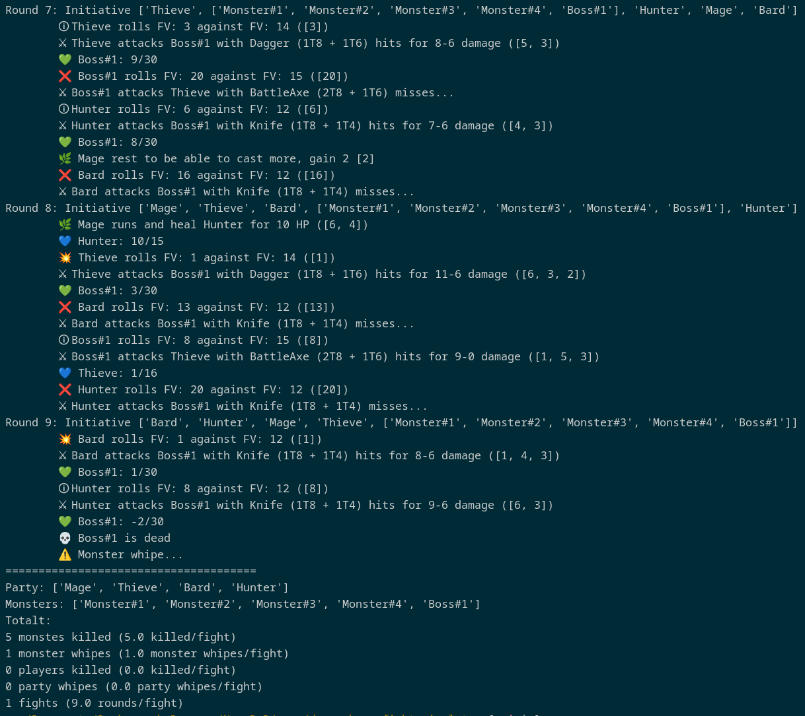

# Dragonbane fight simulator

Small simple simulator to check if your party have a chance or not vs monsters

## Tested with
Works on linux with python3

## Installation
* Make sure you have Python3 installed
* Clone the repository to your computer
`git clone https://github.com/mattiasr/dragonbane_fight_simulator.git`

## Running the simulation
1. Make sure you have weapons, players and monsters added to `simulate.py`
2. Set the number of times you like to run the simulation by edit `total_samples`
3. Run the simulation by executing `python3 simulate.py`

